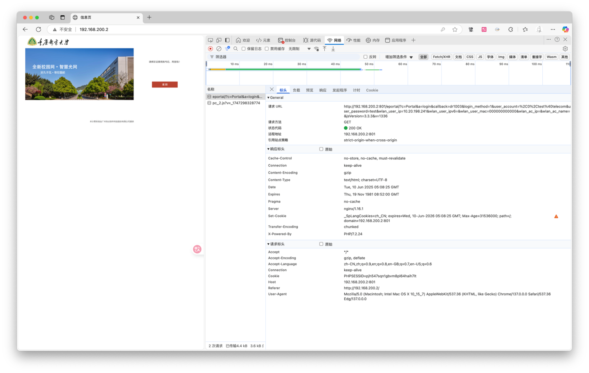

# CQUPT校园网终端登录说明

## 更新日志

* `v1.0.0`：提供对重庆邮电大学校园网登录支持；\<2025.6.11\>

## v1.0.0

> **作者**：[soppylzz](https://github.com/soppylzz)
>
> **联系**：[2251178298@qq.com](mailto:2251178298@qq.com)

### 登录原理

重邮的校园网登录IP是 `192.168.200.2` 。通过浏览器开发者工具抓去登录API，结果如下图所示：

登录时有如下要点：

* 其中 `v=1336` 是1000-9999的四位十进制随机数，在 **SHELL** 中我们可以使用 `v=$((RANDOM % 9000 + 1000))` 生成；
* `mac` 地址不用填写真实数据，使用 `0...` 占位符即可；
* 经过测试我们在使用 `curl` 执行 **GET** 登录命令时，不设置 `Cookie` 的请求头也可以成功登录；

### 登出原理

登出的API获取过程同上，在这里就不过多讲解；